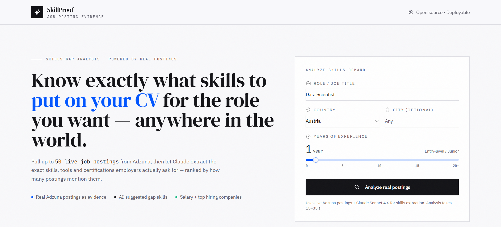
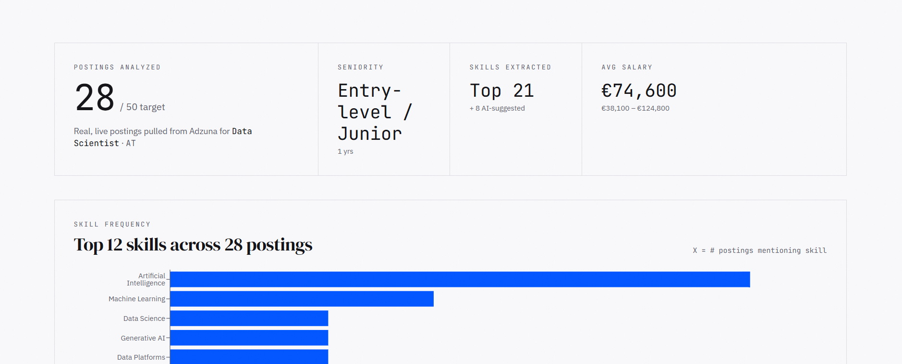
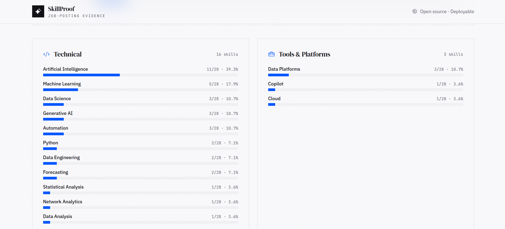
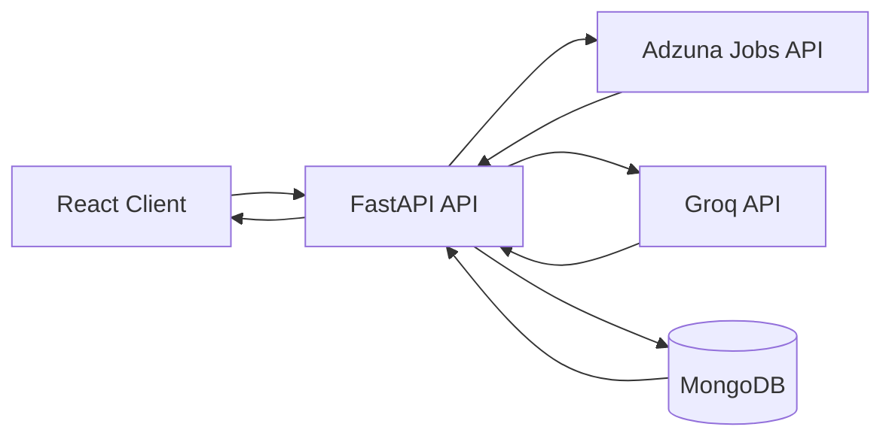

# SkillProof

**Real job-posting intelligence for evidence-based career planning.**

SkillProof analyzes live job postings for a target role, location, and experience level, then surfaces the skills employers ask for most often, salary signals, hiring companies, common job titles, and AI suggested skill gaps.

The project combines live labor market data, NLP and LLM based extraction, backend APIs, caching, and a full stack analytics interface.

## What it does

1. Accepts a target role, country, optional city, and years of experience.
2. Retrieves up to 50 live job postings through the Adzuna API.
3. Cleans and prepares job descriptions for analysis.
4. Uses Groq to extract and normalize technical skills, tools, soft skills, and certifications.
5. Aggregates skill frequency, salary information, top companies, and common titles.
6. Stores analyses in MongoDB and reuses cached results to reduce latency and API cost.
7. Presents the results through an interactive React dashboard with source postings as evidence.

## Screenshots

### Search live job demand



### Market overview and skill frequency



### Skills grouped by category



## Architecture



## Core pipeline

```text
Role + location + experience
            |
            v
     Live job retrieval
            |
            v
 Description cleaning
            |
            v
   LLM skill extraction
            |
            v
 Analytics aggregation
            |
      +-----+-----+
      |           |
      v           v
  MongoDB      FastAPI
   cache           |
                   v
            React dashboard
```

## Technology stack

### Backend

Python, FastAPI, Pydantic, HTTPX, Motor, MongoDB

### AI and NLP

Groq API, JSON Schema structured outputs, prompt engineering, job-description normalization

### Data and analytics

Adzuna Jobs API, salary aggregation, skill frequency analysis, company and title aggregation

### Frontend

React, Tailwind CSS, Axios, Recharts, Radix UI, Phosphor Icons

## API

### `POST /api/analyze`

Example request:

```json
{
  "role": "Machine Learning Engineer",
  "country": "us",
  "city": "New York",
  "years_experience": 2
}
```

The response includes analyzed posting count, skill frequencies, AI suggested skills, salary statistics, top companies, common titles, sample source postings, seniority label, and cache metadata.

### `GET /api/countries`

Returns the countries supported by the current Adzuna integration.

## Local setup

### 1. Clone the repository

```bash
git clone <your-repository-url>
cd SkillProof
```

### 2. Backend

```bash
cd backend
python -m venv .venv
source .venv/bin/activate
pip install -r requirements.txt
cp .env.example .env
```

On Windows PowerShell, activate and copy the example environment file with:

```powershell
.\.venv\Scripts\Activate.ps1
Copy-Item .env.example .env
```

Configure `.env` with your own MongoDB, Groq, and Adzuna credentials.

Create a Groq API key at https://console.groq.com/keys and set these values in `backend/.env`:

```env
GROQ_API_KEY=your_groq_api_key
LLM_MODEL=openai/gpt-oss-20b
```

Restart the backend after editing `.env`. The default model supports strict JSON Schema output.
Groq offers a free tier with request and token limits; check your account limits at
https://console.groq.com/docs/rate-limits. A Groq key is required; an Anthropic key will not work.
When overriding `LLM_MODEL`, choose a model supporting Groq strict structured outputs.


```bash
uvicorn server:app --reload --port 8000
```

### 3. Frontend

```bash
cd frontend
cp .env.example .env
npm install
npm start
```

On Windows PowerShell, use `Copy-Item .env.example .env` instead of `cp`.

The frontend defaults to `http://localhost:3000` and the backend example configuration uses `http://localhost:8000`.

## Environment variables

Backend:

```text
MONGO_URL
DB_NAME
CORS_ORIGINS
GROQ_API_KEY
ADZUNA_APP_ID
ADZUNA_APP_KEY
LLM_MODEL
ANALYSIS_CACHE_TTL_SECONDS
DESC_TRUNCATE_CHARS
```

Frontend:

```text
REACT_APP_BACKEND_URL
```

Never commit real `.env` files or API credentials. Example files contain placeholders only.

## Engineering decisions

**Live evidence rather than static skill lists.** SkillProof derives its analysis from current job postings instead of relying on a manually maintained list of skills.

**Caching.** Equivalent analyses can be reused for a configurable period, reducing external API usage and LLM cost.

**Validated inputs.** Pydantic models validate role, country, city, and experience values before analysis.

**Reliable structured output.** Groq responses use a JSON Schema output constraint and defensive parsing. Truncated or malformed responses are rejected instead of silently repaired.

**Async network calls.** External API communication uses asynchronous HTTP clients so network operations do not unnecessarily block the service.

**Separation of concerns.** Job retrieval, description preparation, AI extraction, aggregation, persistence, and presentation are separated into distinct stages.

## Current limitations

The current version uses an LLM to extract and count skills from the analyzed posting batch. A stronger production design would extract skills per posting, normalize them into a canonical skill ontology, and calculate frequencies deterministically in Python or the analytics database.

Experience level currently influences the analysis context and seniority label. A future version should explicitly extract required experience from each posting and filter the underlying sample before aggregation.

The application currently analyzes a bounded set of live postings per request. A larger market intelligence system should continuously ingest and enrich postings, then serve precomputed analytics from a warehouse.

## Roadmap

1. Per posting deterministic skill counting and evidence mapping.
2. Canonical skill ontology and synonym normalization.
3. Experience requirement extraction and filtering.
4. Historical skill demand snapshots and trend analysis.
5. Candidate resume comparison and prioritized skill gap recommendations.
6. Industry, location, and role comparisons.
7. Background ingestion workers and analytical warehouse for larger scale datasets.
8. Observability, rate limiting, authentication, and production deployment.

## Security

No production credentials are included in this repository. Keep secrets in local environment variables or your deployment platform's secret manager. If a credential has ever been committed or shared, rotate it before deployment.

## License

MIT
